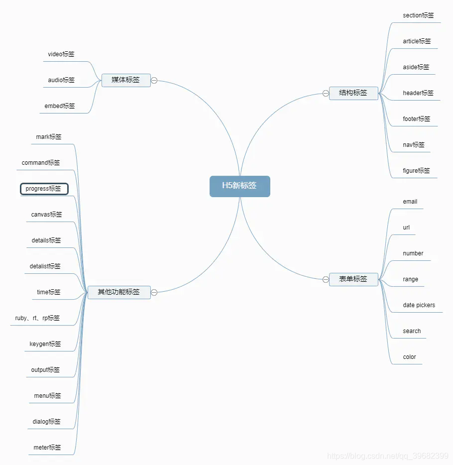

@[TOC](HTML标签)

# 根标签

 - `<html>` html文档的根元素

	
#  元数据标签
元数据含有页面的相关信息，包括样式、脚本及数据，能帮助一些软件 (如搜索引擎， 浏览器等等）更好地运用和渲染页面。对于样式和脚本的元数据，可以直接在网页里定义，也可以链接到包含相关信息的外部文件。

 - `<title>` 文档的标题
 - `<link>` 引入外部资源
 - `<style>`样式信息
 - `<meta>` 文档元数据
 - `<base>` 为文档中的链接设置默认的地址或者目标

# 内容分区标签
内容分区元素允许你将文档内容从逻辑上进行组织划分。使用包括页眉(header)、页脚(footer)、导航(nav)和标题(h1~h6)等分区元素，来为页面内容创建明确的大纲，以便区分各个章节的内容。

 - `<h1>` -- `<h6>` 标题内容
 - `<header>` 页眉内容
 - `<nav>` 导航
 - `<section>` 表示文档的一个区域，通过是否含一个标题作为子节点来辨识
 - `<aside>` 与文档无关的内容
 - `<footer>` 页脚内容
 - `<article>` 表示文档、页面、应用或网站中的独立结构
 - `<address>` 地址信息

#  文本标签

使用 HTML 文本内容元素来组织在开标签 <body> 和闭标签 </body> 里的块或章节的内容。这些元素能标识内容的宗旨或结构，而这对于 accessibility 和 SEO 很重要。

 - `<div>`  文档分区元素， 通用型流内容容器v
 - `<p>` 段落
 - `<main>` 文章的主体
 - `<pre>` 预定义格式文本
 - `<ol>` 有序列表
 - `<ul>` 无序列表
 - `<li>` 列表元素
 - `<dl>` 定义列表
 - `<dt>` 定义列表元素
 - `<dd>` 定义列表描述
 - `<figure>` 代表一段独立的内容
 - `<figcaption>` 和figure配合使用，图片说明/标题
 - `<blockquote>` 块级引用元素
 - `<hr>` 水平线

# 内联文本语义标签
使用 HTML 内联文本语义(Inline text semantics)定义语句，结构，可以是一个词，一段，或任意风格的文字。

 1. `<span>` <span>通用行内容器
 2. `<b>`<b>  提醒注意 粗体
 3. `<i>` <i> 区分，斜体
 4. `<u>` <u>下划线
 5. `<em>`  <em>强调 斜体
 6. `<strong>` <strong>更加强调 粗体
 7. `<a>` <a> 超链接
 8. `<q>` <q> 引用文本
 9. `<mark>` <mark> 标记文本
 10. `<code>` <code> 代码段
 11. `<br>` 换行 
 12. `<abbr>` 缩写
 13. `<bdi>` 双向隔离元素
 14. `<bdo>` 双向覆盖元素
 15. `<sub>` <sub> 下标
 16. `<sup>` <sup> 上标
 17. `<time>` 时间
 18. `<cite>` <cite>表示一个作品的引用 
 19. `<data>` 将一个指定内容和机器可读的翻译联系在一起
 20. `<dfn>` <dfn> 表示术语的一个定义
 21. `<kbd>` <kbd> 用户输入
 22. `<tt>` <tt>等宽字体
 23. `<var>` <var>表示变量的名称，或者由用户提供的值
 24. `<wbr>` 一个文本中的位置，其中浏览器可以选择来换行
 
#  编辑标识
 - `<del>`  表示一些被从文档中删除的文字内容
 - `<ins>`  定义已经被插入文档中的文本
#  图片和多媒体

 - `` 图片
 - `<audio>`音频
 - `<video>` 视频
 - `<track>` 被当作媒体元素—`<audio>` 和 `<video>`的子元素来使用。它允许指定计时字幕（或者基于事件的数据），例如自动处理字幕。
 - `<map>` 和`<area>` 定义一个图像映射
 - `<area>` 在图片上定义一个热点区域，可以关联一个超链接。

#  内嵌内容

 - `<iframe>` 表示嵌套的浏览上下文，有效地将另一个HTML页面嵌入到当前页面中。
 - `<embed>` 将外部内容嵌入文档中的指定位置
 - `<object>` 表示引入一个外部资源
 - `<param>`  定义了 <object>的参数
 - `<picture>` 容器，用来为其内部特定的  元素提供多样的 <source> 元素。
 - `<source>` 资源

#  脚本

 - `<script>` 引入可执行脚本
 - `<noscript>` 替代未被执行的脚本
 - `<canvas>` 画布，使用javascript绘制图形

#  表格

 - `<table>` 表格
 - `<caption>` 表格的标题
 - `<thead>` 页眉
 - `<tbody>` 表格主体
 - `<tfoot>` 页脚
 - `<th>` 表头
 - `<tr>` 行
 - `<col>` 列
 - `<colgroup>`表格列组
 - `<td>` 表格单元

#  表单

 - `<form>` 表单
 - `<input>` 输入域
 - `<textarea>` 多行文本域
 - `<label>` 标题
 - `<button>` 按钮
 - `<datalist>` 包含了一组<option>元素,这些元素表示其它表单控件可选值
 - `<fieldset>` 一组相关的表单元素，并使用外框包含起
 - `<legend>` 表示它的父元素<fieldset>的内容的标题
 - `<meter>` 显示已知范围的标量值或者分数值
 - `<optgroup>` 一个 <select> 元素中的一组选项
 - `<option>`  用于定义在<select>,  <optgroup> 或<datalist> 元素中包含的项
 - `<output>` 表示计算或用户操作的结果
 - `<progress>` 进度条
 - `<select>` 选项菜单

#  交互元素

 - `<details>`
 - `<summary>` 用作 一个<details>元素的一个内容的摘要，标题或图例。
 - `<dialog>` 对话框
 - `<menu>` 菜单

#  web 组件

 - `<slot>` web组件技术的一部分，slot是web组件的一个占位符
 - `<template>` 用于保存客户端内容的机制

#  过时 弃用的标签

```
<acronym><applet><basefont><bgsound><big><blink><center><command><content><dir><element><font><frame><frameset><image><isindex><keygen><listing><marquee><menuitem><multicol><nextid><nobr><noembed><noframes><plaintext><spacer><strike><shadow><tt><xmp>
```
#  HTML5 新标签


#  常用内联元素，块级元素
 - 块级元素： 
   - 特点 ： 
     1. 块级元素独占一行，从上往下分布
     2. 可以设置宽度，高度，盒子模型
     3. 没有设置宽度时，宽度为父元素宽度
     4. 没有设置高度时，高度为内容高度
   - 常用
     - `<div> <p> <h1>-<h6> <ol><ul><li> <dl><dt><dd> <menu> <hr> <table> <form>`
 - 内联元素
   - 特点
     1. 从左到右显示为一行
     2. 不能设置宽度高度盒子模型，可以设置margin，padding水平方向的值，垂直方向的值无法设置
     3. 宽高由本身内容决定
     4. 只能容纳内联元素，无法容纳块级元素
   - 常用
   	  -  `<span> <a> <strong> <label> <input>   <select> <strong>`
#  参考
[https://www.jianshu.com/p/04e541183329](https://www.jianshu.com/p/04e541183329)
